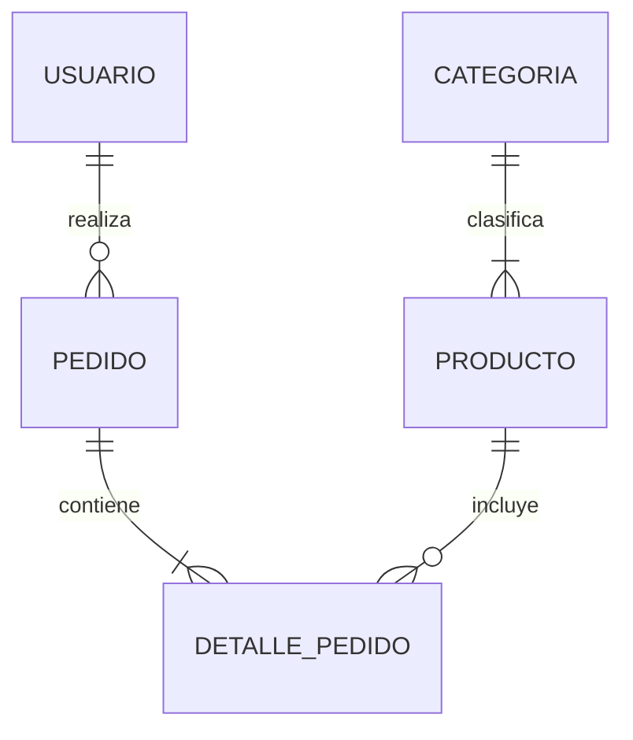

# 🗄️ Proyecto de Base de Datos: Sistema de E-Commerce (Ejemplo)

## 📖 Descripción General del Proyecto
Este proyecto implementa una base de datos relacional robusta, escalable y optimizada para la gestión de un sistema de comercio electrónico. Su propósito es administrar de manera eficiente la información de usuarios, productos, pedidos y transacciones, garantizando la integridad de los datos, alta disponibilidad y tiempos de respuesta rápidos para consultas complejas.

## 🏗️ Arquitectura de la Base de Datos
La arquitectura está basada en un modelo de base de datos relacional (RDBMS) estructurada en múltiples esquemas para separar lógicamente los dominios de la aplicación (ej. `ventas`, `inventario`, `usuarios`). 
Se implementa una arquitectura Cliente-Servidor donde la base de datos se aloja en un servidor centralizado (o en la nube) con replicación maestro-esclavo para alta disponibilidad.

## 📊 Diagrama Entidad-Relación (ERD)

A continuación se describe la relación entre las entidades principales:

- **Usuario (1) -- (N) Pedido:** Un usuario puede realizar múltiples pedidos.
- **Pedido (1) -- (N) Detalle_Pedido:** Un pedido contiene múltiples líneas de detalle.
- **Producto (1) -- (N) Detalle_Pedido:** Un producto puede estar en múltiples pedidos.
- **Categoria (1) -- (N) Producto:** Una categoría agrupa múltiples productos.

*Representación en texto del Diagrama:*


## 📚 Diccionario de Datos

### Tabla: `usuarios`
| Columna | Tipo de Dato | Restricciones | Descripción |
|---------|--------------|---------------|-------------|
| `id_usuario` | INT | PK, Auto Inc | Identificador único del usuario. |
| `nombre` | VARCHAR(100) | NOT NULL | Nombre completo del usuario. |
| `email` | VARCHAR(150) | UNIQUE, NOT NULL | Correo electrónico de contacto. |
| `fecha_registro`| TIMESTAMP | DEFAULT NOW() | Fecha en que el usuario se registró. |

### Tabla: `productos`
| Columna | Tipo de Dato | Restricciones | Descripción |
|---------|--------------|---------------|-------------|
| `id_producto` | INT | PK, Auto Inc | Identificador único del producto. |
| `id_categoria`| INT | FK | Referencia a la categoría del producto.|
| `nombre` | VARCHAR(200) | NOT NULL | Nombre del producto. |
| `precio` | DECIMAL(10,2)| NOT NULL | Precio unitario del producto. |
| `stock` | INT | DEFAULT 0 | Cantidad de unidades disponibles. |

*(Nota: Repetir esta estructura para otras tablas como `pedidos`, `categorias`, etc.)*

## ⚙️ Instrucciones de Instalación y Configuración

### Prerrequisitos
- PostgreSQL 14+ o MySQL 8.0+
- Cliente de línea de comandos (`psql` o `mysql`)
- Docker y Docker Compose (opcional, para despliegue en contenedores)

### Pasos de Instalación
1. **Clonar el repositorio:**
   ```bash
   git clone https://github.com/tu-usuario/proyecto-bd.git
   cd proyecto-bd
   ```
2. **Iniciar la base de datos usando Docker (Opcional):**
   ```bash
   docker-compose up -d
   ```
3. **Ejecutar el script de inicialización (Esquema y datos semilla):**
   ```bash
   # Para PostgreSQL
   psql -U usuario -d nombre_bd -f init_schema.sql
   psql -U usuario -d nombre_bd -f seed_data.sql
   ```
4. **Configurar las variables de entorno:**
   Copia el archivo `.env.example` a `.env` y configura tus credenciales de acceso:
   ```env
   DB_HOST=localhost
   DB_PORT=5432
   DB_USER=root
   DB_PASSWORD=secreta
   DB_NAME=tienda_db
   ```

## 🏆 Mejores Prácticas Implementadas

* **Normalización:** La base de datos está normalizada hasta la 3ra Forma Normal (3FN) para minimizar la redundancia de datos y prevenir anomalías en la actualización, inserción y borrado.
* **Indexación Estratégica:** Se han creado índices B-Tree en columnas frecuentemente consultadas en cláusulas `WHERE` (como `email` de usuarios) y claves foráneas para acelerar los `JOINs`.
* **Seguridad:** 
  - Se utiliza cifrado de contraseñas (hash) a nivel de aplicación (la BD solo almacena hashes).
  - Implementación de roles de usuario (RBAC) con principio de mínimo privilegio (ej. el rol `app_user` solo tiene permisos de `SELECT`, `INSERT`, `UPDATE`).
* **Integridad Referencial:** Uso estricto de claves foráneas con reglas `ON DELETE CASCADE` u `ON DELETE RESTRICT` según corresponda para evitar registros huérfanos.
* **Transacciones (ACID):** Los procesos críticos, como el procesamiento de pagos y reducción de stock, se ejecutan dentro de bloques `BEGIN ... COMMIT` para asegurar que los datos permanezcan consistentes.

## 💻 Guía de Uso de Consultas Comunes

### 1. Obtener el historial de pedidos de un usuario específico
```sql
SELECT p.id_pedido, p.fecha, dp.cantidad, pr.nombre, (dp.cantidad * pr.precio) as total_linea
FROM pedidos p
JOIN detalle_pedido dp ON p.id_pedido = dp.id_pedido
JOIN productos pr ON dp.id_producto = pr.id_producto
WHERE p.id_usuario = 123
ORDER BY p.fecha DESC;
```

### 2. Consultar productos con bajo stock (para reabastecimiento)
```sql
SELECT id_producto, nombre, stock
FROM productos
WHERE stock < 10
ORDER BY stock ASC;
```

### 3. Calcular los ingresos totales por mes
```sql
SELECT DATE_TRUNC('month', fecha) AS mes, SUM(total) AS ingresos_totales
FROM pedidos
WHERE estado = 'COMPLETADO'
GROUP BY mes
ORDER BY mes DESC;
```

---
*Documentación generada y mantenida por el equipo de desarrollo de Base de Datos.*